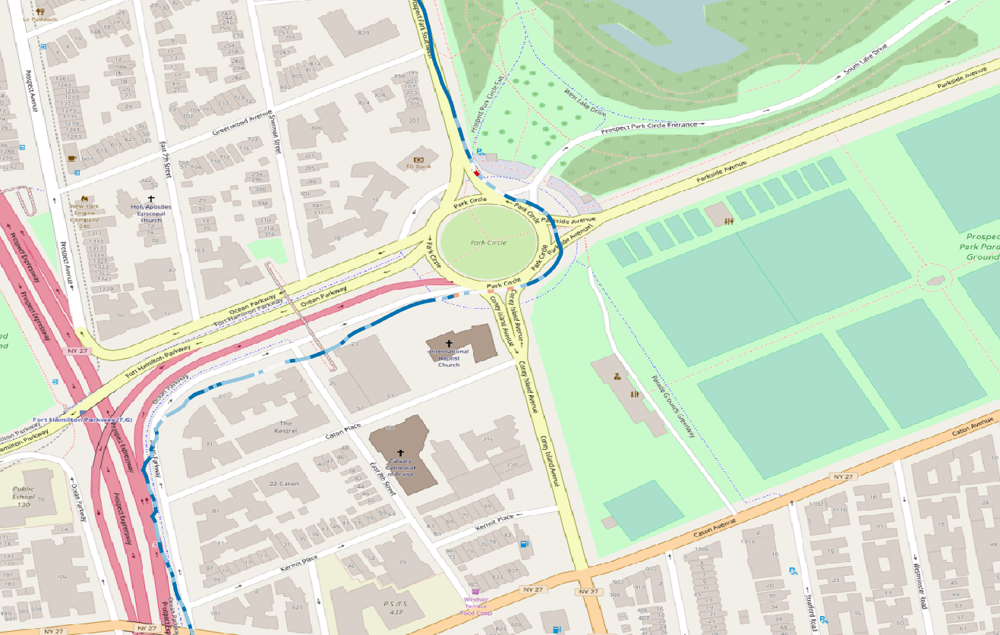

# OSCstats
Project to read cellphone sensors using OSC and get stats

## Original data
The data from OSC is stored in a txt file in:

*local/android/data/com.telenav.streetvie.../files/OSV*

## Output

The final output is a polyline with the resulting vector of the 3 axis (X,Y,Z) from the accelerometer as an attribute. This vector measures how *fluid* is the bike-lane. Sudden braking to avoid a pothole or any other interruption in the bike-lane, a swiftly turn in the handle (where the sensor was located) to avoid potholes or other obstacles will affect X and Y axis. Finally, passing through an actual pothole will be measured in the Z axis.

## Columns data:
[Source](https://github.com/openstreetcam/openstreetview.org/issues/109)
* timestamp
* lon
* lat
* elevation 
* horizontal_accu
* GPSspeed
* yaw
* pitch
* roll
* accelerationX
* accelerationY
* accelerationZ
* pressure
* compas
* vIndex
* tFIndex
* gravityX
* gravityY
* gravityZ
* OBD2Speed
* vertical_accu

